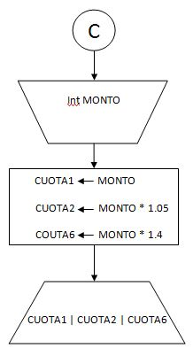
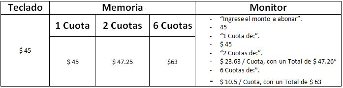

#Plantilla para ejercicios del Módulo 1.

####Enunciado:
*Dado un número real que representa el importe de una compra, informar las posibles formas de pago, según la siguiente tabla:*

*1 Cuota de $ ...*

*2 Cuotas de $ ... con un total de $ ... (5% de recargo)*

*6 Cuotas de $ ... con un total de $ ... (40% de recargo)*
___
| Datos | De entrada | De salida |
|-------|------------|-----------|
|       | Un número entero que identificaremos como IMPORTE | El monto por cuota y el total correspondiente, segun el cuadro de recargos.|

#####Estrategia:
* Solicitar e ingresar el monto a abonar por teclado.
* Informar por monitor el monto por 1 cuota.
* Calcular monto y total por dos cuotas e informar por monitor.
* Calcular monto y total por seis cuotas e informar por monitor.

___

#####Algoritmo de Resolución.

___
#####Seguimiento.

