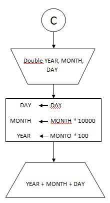
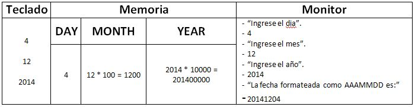

#Plantilla para ejercicios del Módulo 1.

####Enunciado:
*Dada una terna de numeros naturales, que representan el dia, mes y año de una determinada fecha, informarla como un solo numero de 8 digitos (AAAAMMDD).*
___
| Datos | De entrada | De salida |
|-------|------------|-----------|
|       | Tres numeros enteros naturales, identificados como DAY, MONTH y YEAR respectivamente. | Un numero de 8 digitos con la forma AAAAMMDD. |

#####Estrategia:
* Solicitar e ingresar el año.
* Solicitar e ingresar el mes.
* Solicitar e ingresar el dia.
* Multiplicar año por 10000 y mes por 100.
* Informar fecha (año + mes + dia).

___

#####Algoritmo de Resolución.

___
#####Seguimiento.

