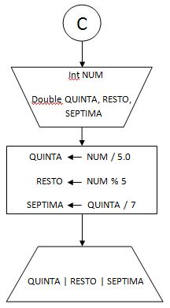
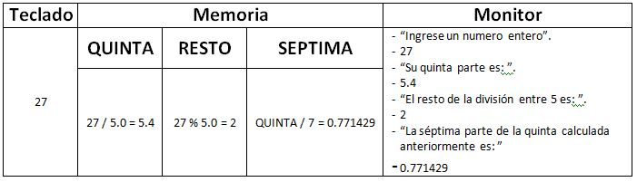

#Plantilla para ejercicios del Módulo 1.

####Enunciado:
*A partir de un número entero ingresado por teclado, se pide informar: su quinta parte, el resto de su división entre 5 y la septima parte de su quinta parte calculada primeramente.*
___
| Datos | De entrada | De salida |
|-------|------------|-----------|
|       | Un numero entero que se identificará como NUM. | Su quinta parte, el resto de la division entre cinco y la septima parte calculada sobre el quinto calculado con anterioridad |

#####Estrategia:
* Solicitar el ingreso de un numero entero.
* Solicitar e informar la quinta parte .
* Solicitar e informar el resto de la division entre 5.
* Solicitar e informar el resultado de (numero / 5) / 7.

___

#####Algoritmo de Resolución.

___
#####Seguimiento.

