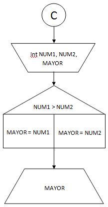
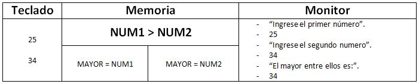

#Plantilla para ejercicios del Módulo 1.

####Enunciado:
*Dado dos valores enteros y distintos, emitir una leyenda apropiada que informe cual es le mayor entre ellos.*
___
| Datos | De entrada | De salida |
|-------|------------|-----------|
|       | Dos numeros enteros y distintos entre si. identificados como NUM1 y NUM2, respectivamente | Leyenda indicando cual es el mayor. |

#####Estrategia:
* Solicitar ingresar el primer número por teclado.
* Solicitar ingresar el segundo número por teclado.
* Calcular e informar por monitor el mayor de ellos.

___

#####Algoritmo de Resolución.

___
#####Seguimiento.

