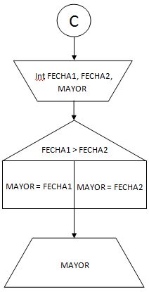
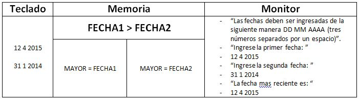

#Plantilla para ejercicios del Módulo 1.

####Enunciado:
*Dada dos fechas informar cual es la mas reciente. Determine cuales serian los datos de entrada y las leyendas a informar de acuerdo al proceso solicitado.*
___
| Datos | De entrada | De salida |
|-------|------------|-----------|
|       | Primer fecha ingresada como tres numeros separados por un espacio identificada como FECHA1. Segunda fecha ingresada como tres numeros separados por un espacio identificada como FECHA2. | Leyenda indicando cual es el mayor. |

#####Estrategia:
* Informar el formato en que se ingresan las fechas (DD MM AAAA).
* Solicitar e ingresar la primer fecha por teclado.
* Solicitar e ingresar la segunda fecha por teclado.
* Calcular e informar por monitor la fecha mas reciente.

___

#####Algoritmo de Resolución.

___
#####Seguimiento.

